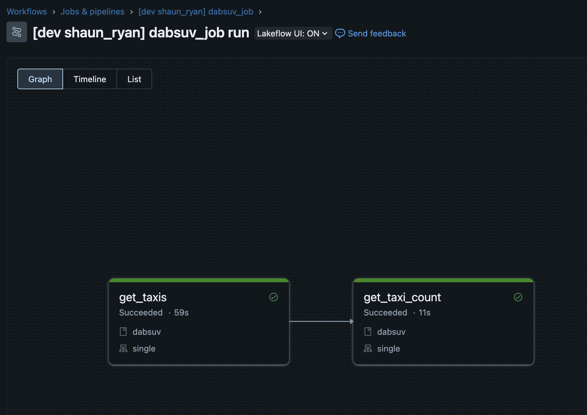

# Databricks Asset Bundle workflow setup with UV

The 'manisha' project was generated by using the DABs default-python template and setup with python uv

1st setup a databricks vscode project using the extension button `create project` at the current root. Choose the python lib template. Then follow the steps:

1. delete the setup.py
2. delete the dev_requirements.txt
3. initialise with uv `uv init --package --name=manisha .`
4. pin your python version with the version on the cluster your deploying too 
5. add databricks-connect and any other dev dependencies `uv add --dev 'databricks-connect`
6. sync and create the venv `uv sync`
7. Go through the rest of the configuration steps on the databricks connect setup using the extension; select the cluster, setup databricks connect etc
8. Setup your entry points in the `./project.toml` to your code entry points under the `[project.scripts]` config section
9. Add the uv build into the `./databricks.yml` under the artefact definition
10. Wire up the entry points to the workflow tasks in `./resources/manisha.job.yml`
11. Deploy the workflow to databricks using the extension

